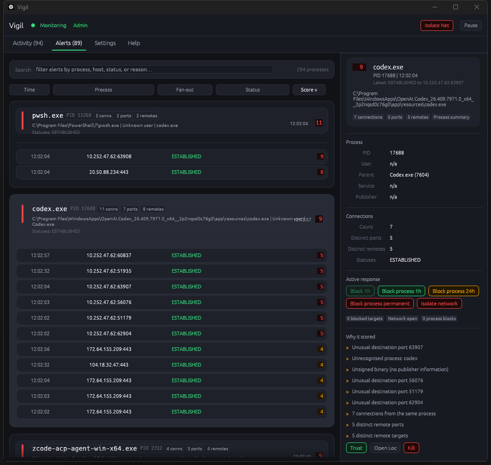

# Vigil

Real-time network threat monitor for Windows, macOS, and Linux.

<span style="color: red;">WARNING! The current version of Vigil works only as a monitor; all active features, like the panic button, are under heavy development.</span> 

## Download the latest build

- [Windows installer](https://github.com/YMRYMR/vigil/releases/latest/download/Vigil-latest-windows-x86_64.exe)
- [macOS DMG](https://github.com/YMRYMR/vigil/releases/latest/download/Vigil-latest-macos-aarch64.dmg)
- [Linux AppImage](https://github.com/YMRYMR/vigil/releases/latest/download/Vigil-latest-linux-x86_64.AppImage)
- [All supported OSs bundle](https://github.com/YMRYMR/vigil/releases/latest/download/Vigil-latest-all-supported-os.zip)

Each release asset is published with a GitHub artifact attestation. Verify a
downloaded file with:

```bash
gh attestation verify PATH/TO/FILE -R YMRYMR/vigil
```

Vigil watches every TCP/UDP connection on your machine, scores each one for
suspicious behaviour, and alerts you — via a system tray icon, desktop
notification, and a full GUI — the moment something looks wrong.



---

## Features

- **Sub-100 ms detection** on Windows via ETW (Event Tracing for Windows);
  polling fallback on other platforms
- **Multi-signal threat scoring** (0–10+) across eight detection categories
- **Full ancestor process tree** — see exactly which process spawned which,
  up to 8 levels deep
- **System tray** — amber icon + tooltip on alert; green when all-clear;
  left-click opens the UI, right-click shows the menu
- **Clickable notifications** — clicking a desktop alert opens Vigil and
  navigates directly to the triggering connection
- **Full GUI** — process-grouped Activity and Alerts views, a process-first
  Inspector, auto-save Settings, persisted grid sort/window state, a
  polished Help screen, and a header that clearly shows whether Vigil is
  elevated
- **Active response** — reversible Windows actions for killing a live TCP
  connection, suspending or resuming a process during investigation,
  blocking a remote IP for 1 hour, 24 hours, or permanently, blocking a
  process by executable path, or isolating the machine, with confirmation
  prompts, live countdowns for temporary blocks, and one-click unblock
  buttons
- **Rolling daily log** at the per-user Vigil data directory under `logs/vigil.YYYY-MM-DD`
- **Autostart at login** enabled on first run (configurable in Settings);
  if Vigil is launched elevated on Windows, future autostart uses a
  highest-privilege scheduled task so it keeps admin visibility

---

## How the score works

Each new connection is scored independently across seventeen signals. Points
stack — a PowerShell process spawned by Word, connecting to port 4444, can
score 3 + 3 + 4 + 5 = 15. The alert threshold is configurable (default: 3).

| Points | Signal |
|--------|--------|
| +5 | Connection to a known malware / C2 port (4444, 1337, 31337, …) |
| +4 | Living-off-the-land binary making a network connection (`powershell`, `cmd`, `mshta`, …) |
| +3 | No executable path found — possible process injection or hollowing |
| +3 | Running from a suspicious directory (`\Temp\`, `\AppData\Roaming\`, …) |
| +3 | Suspicious parent process (e.g. `winword.exe` spawning `powershell.exe`) |
| +3 | Beaconing pattern detected — regular C2 callback timing signature |
| +3 | IP reputation hit — remote matched a user-supplied blocklist (**Phase 10**, REP badge) |
| +3 | Executable was just dropped into Temp/AppData/Downloads before connecting (**Phase 10**, DRP badge) |
| +2 | Unrecognised process (not on your trusted list) |
| +2 | Unsigned binary — no code-signing certificate |
| +2 | DNS query (port 53) from a non-DNS process — possible DNS tunneling |
| +2 | Connection observed **before user login** — rootkit / dropper signal (PL badge) |
| +2 | Connection to an unexpected country (**Phase 10**, requires `allowed_countries`) |
| +2 | Long-lived connection from untrusted process past threshold (**Phase 10**, LL badge) |
| +2 | Hostname looks DGA-generated — high Shannon entropy (**Phase 10**, DGA badge) |
| +1 | Unusual destination port for an untrusted process |

Trusted processes skip the **+2 unrecognised** and **+2 unsigned** penalties,
so routine connections from browsers and system services score 0.  High-severity
signals (malware ports, LoLBins, pre-login activity) still apply — if a trusted
app suddenly dials a C2 port, you want to know.

Vigil also runs two passive persistence watchers that raise synthetic alerts
(independent of active connections):

- **Registry autorun watcher** (Windows) — polls `HKCU\…\Run`, `HKLM\…\Run`,
  and both `RunOnce` keys every 30 s; alerts on any new entry.
- **Beaconing detector** — tracks inter-arrival time per `(pid, remote_ip)`
  across a rolling 30-sample window; flags stddev < 5 s / mean 1 – 600 s.

---

## Installation

### Windows — one-click installer

1. Download `Vigil-Setup-<version>-x86_64.exe` from the [latest release].
2. Run the installer — it places Vigil in `Program Files`, creates a Start
   Menu shortcut, and registers it for autostart.

> **Note:** ETW-based real-time monitoring requires Administrator rights.
> Without elevation, Vigil falls back to polling every few seconds — all
> other features work normally.

### macOS — DMG

1. Download `Vigil-<version>-aarch64.dmg` from the [latest release].
2. Open the DMG and drag **Vigil.app** to your Applications folder.
3. Launch Vigil — it will ask for network monitoring permission on first run.

### Linux — AppImage

1. Download `Vigil-<version>-x86_64.AppImage` from the [latest release].
2. Make it executable: `chmod +x Vigil-*.AppImage`
3. Double-click to run, or launch from the terminal.

---

## Building from source

**Prerequisites:** [Rust stable](https://rustup.rs) 1.75+

```sh
git clone https://github.com/YMRYMR/vigil.git
cd vigil
cargo build --release
```

The binary is written to `target/release/vigil` (or `vigil.exe` on Windows).

### Using `just`

Install [just](https://just.systems) then:

```sh
just build      # debug build
just release    # optimised release build
just test       # run the test suite
just lint       # clippy -D warnings
just install    # copy release binary to the system (platform-specific)
just ci         # fmt-check + lint + test (mirrors CI)
```

### Windows icon embedding

`build.rs` generates a multi-size `.ico` file and embeds it via
[`winres`](https://crates.io/crates/winres).  This requires the Windows SDK
(`rc.exe`) or [`llvm-rc`](https://llvm.org/docs/CommandGuide/llvm-rc.html).
If neither is present the build still succeeds — it just won't have the
custom icon in the taskbar.

---

## Configuration

Settings are stored in `vigil.json` in the per-user Vigil data directory and are fully
editable in-app via the **Settings** tab:

| Setting | Default | Description |
|---------|---------|-------------|
| `alert_threshold` | 3 | Minimum score to trigger an alert |
| `poll_interval_secs` | 5 | Seconds between full connection polls |
| `log_all_connections` | false | Log every connection, not just suspicious ones |
| `autostart` | true | Launch Vigil at login; elevated Windows runs use a highest-privilege scheduled task |
| `trusted_processes` | *(see below)* | Process names exempt from low-level scoring |

### Default trusted processes

Vigil ships with a curated list of common trusted processes (browsers,
Windows system services, antivirus, communication apps, etc.) so you get
useful alerts out of the box without tuning. On first run that list is
written into `vigil.json` in the per-user Vigil data directory as the
starting config, and any later edits you make in-app persist immediately.
You can add or remove entries in the
**Settings → Trusted Processes** grid, or click **Trust** in the Inspector
panel while a real process with a known executable location is selected.
The Settings tab also includes a `Reset shipped defaults` button if you want
to restore the bundled list.

The Inspector disables `Trust` and `Open Loc` when the executable location is
unknown, and disables `Kill` for unresolved PID placeholder rows like
`<11540>`.

### Active response

The top bar also reflects privilege state: it shows an `Admin` badge when
Vigil is elevated, or a `Run as Admin` button that relaunches the app with
UAC if it is not.

When Vigil is running with administrator privileges on Windows, the Inspector
can now take reversible action:

- **Kill connection** immediately tears down the selected live TCP socket.
- **Suspend process** freezes the selected PID without killing it; **Resume process** continues it later.
- **Block remote** lets you choose a 1 hour, 24 hour, or permanent outbound
  firewall rule for the selected connection's remote IP. Temporary blocks show
  a live countdown and an inline unblock button.
- **Block process** lets you choose a 1 hour, 24 hour, or permanent firewall
  rule for all traffic from the selected executable path. Temporary blocks
  show a live countdown and an inline unblock button.
- **Isolate network** adds reversible firewall rules that block inbound and
  outbound traffic for the machine.
- All actions require confirmation and can be undone from the same UI.

---

## Logs

Log files land in `<exe-dir>/logs/` and rotate daily:

```
vigil.2025-07-04
vigil.2025-07-05
```

Each line follows the format:

```
2025-07-04 14:23:01.412  INFO chrome.exe (1234) | 192.168.1.5:54321 → 142.250.80.46:443 | score=0
2025-07-04 14:23:05.119  WARN powershell.exe (9012) | 10.0.0.2:61000 → 10.10.10.10:4444 | score=9
```

Open the log folder via the tray icon context menu → **Open Logs Folder**.
The folder is inside the per-user Vigil data directory.

---

## Running before login (all platforms)

Vigil can install itself as a boot-time service so monitoring starts
**before any user logs in** — useful for detecting rogue processes that
activate early in the boot sequence (rootkits, dropper callbacks,
persistence mechanisms).

Connections captured before login get a **+2 score bump** and a red
**`PL`** badge in the Time column, so when the first user logs in they
immediately see everything the monitor caught during boot.

From an elevated shell:

| OS      | Command                                          |
| ------- | ------------------------------------------------ |
| Windows | `vigil.exe --install-service`   *(Admin CMD)*    |
| macOS   | `sudo vigil --install-service`                   |
| Linux   | `sudo vigil --install-service`                   |

To remove the boot-time service, replace with `--uninstall-service`.

Under the hood:

- Windows uses the Service Control Manager (`sc create Vigil …`).
- macOS writes a launchd system daemon at
  `/Library/LaunchDaemons/com.vigil.monitor.plist` and `launchctl load`s it.
- Linux writes a systemd unit at `/etc/systemd/system/vigil.service` and
  enables it with `systemctl enable --now vigil.service`.

Note: service mode runs the **monitor only** — the tray icon and GUI
require a logged-in desktop session and launch normally via autostart.

---

## Reputation, geolocation & file-drop correlation (Phase 10)

Vigil layers offline reputation data on top of its behavioural scoring.
All of it is off by default; point the config at your data to enable it.

### Add geolocation and ASN lookup

Download the free MaxMind GeoLite2-City and GeoLite2-ASN `.mmdb` files
from https://www.maxmind.com/en/geolite2/signup and drop them anywhere
on disk. Then edit the `vigil.json` file in the per-user Vigil data directory:

```json
{
  "geoip_city_db": "C:\\vigil\\GeoLite2-City.mmdb",
  "geoip_asn_db":  "C:\\vigil\\GeoLite2-ASN.mmdb",
  "allowed_countries": ["US", "GB", "ES"]
}
```

With the City DB, every row in Activity and Alerts gets a country code
in the Remote column. With the ASN DB, the Inspector shows the remote's
ASN number and AS organisation (e.g. `AS15169  Google LLC`). With
`allowed_countries` set, connections to anywhere else score **+2**.

### Add IP blocklists

Drop plain-text blocklists anywhere and list them:

```json
{
  "blocklist_paths": [
    "C:\\vigil\\abuseipdb.txt",
    "C:\\vigil\\firehol-level1.txt"
  ]
}
```

Format: one IP or CIDR per line, `#` starts a comment. Hits add **+3**
and the Alerts row gets a red `REP` badge naming the source list.

### File-drop correlation

Enabled by default. Vigil watches `%TEMP%`, `%LOCALAPPDATA%\Temp`,
`%APPDATA%`, `Downloads`, and (on Unix) `/tmp` and `/var/tmp` for new
`.exe` / `.dll` / `.ps1` / `.scr` / `.msi` / `.sh` / `.py` drops. When a
connection originates from a file that was dropped within the last
`fswatch_window_secs` seconds (default 600), Vigil adds **+3** and shows
a `DRP` badge. This catches staged-payload chains
(phish → macro → dropper → callback) in flagrante.

### Long-lived connection bonus

Untrusted processes that hold a connection open past `long_lived_secs`
(default 3600 s = 1 h) earn **+2** and an `LL` badge. Browsers and other
trusted processes are exempt.

### DGA hostname detection

Off by default because reverse-DNS queries leak the fact Vigil is
watching to the OS resolver. Turn it on with `"reverse_dns_enabled":
true` in the config. Hostnames whose leftmost label has Shannon entropy
≥ `dga_entropy_threshold` (default 3.2 bits/char) earn **+2** and a
`DGA` badge. Brand names like `google.com` or `paypal.com` score well
below the threshold; machine-generated strings like `xj4k8s9qzr.com`
trip it.

---

## Contributing

See [CONTRIBUTING.md](CONTRIBUTING.md) for guidelines on bug reports, feature
requests, and pull requests.

---

## License

[MIT](LICENSE)

[latest release]: https://github.com/YMRYMR/vigil/releases/latest
